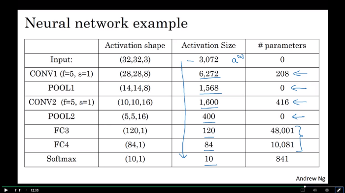

# How to calculate the number of parameters in the CNN  

kernel_size: the size of the filter that is run over the images   
stride: controls the stride for the cross-correlation, how far the filter is moved after each computation  
padding: pads the input volume with __2*padding__ around the border  

----------------------------------------------------------------------  

# In each Conv Layer the network tries to understand the basic patterns  

For example: 
1. In the First layer, the network tries to learn patterns and edges.  
2. In the second layer, it tries to understand the shape/color and other stuff.  
3. A final layer called Feature layer/Fully Connected Layer tries to classify the image  

-----------------------------------------------------------------------  

## Various layer in CNN network  

  

Input Layer: All the input layer does is read the image. So, there are no parameters learn in here.  

Convolutional Layer: Consider a convolutional layer which takes “l” feature maps as the input and has “k” feature maps as output. The filter size is “n*m”.  
e.g., 
l = 32 --> input feature maps as inputs  
k = 64 --> 64 feature maps as outputs  
filter size --> n =3 & m = 3  
(as the input has 32 dimensions, we have 3*3*32 filter)  
(as an output from the first conv layer, learn 64 different 3*3*32 filters --> total weights: n*m*k*l)  
(for each feature map, there is a bias --> total number of parameters: [n*m*l + 1]*k )  

Pooling Layer: There are no parameters you could learn in pooling layer. This layer is just used to reduce the image dimension size.  

Fully-connected Layer: all inputs units have a separable weight to each output unit. For “n” inputs and “m” outputs, the number of weights is “n*m”. Additionally, this layer has the bias for each output node, so “(n+1)*m” parameters.  

Output Layer: This layer is the fully connected layer, so “(n+1)m” parameters, when “n” is the number of inputs and “m” is the number of outputs.  

-----------------------------------------------------------------------  
## Example: compute new activation shape  

  

original size: k  
filter shape: n * n  
stride: m  
pad: l  

new activation shape = x*x  
(k + 2*pad - n)/m + 1=x  

-----------------------------------------------------------------------  

## Example: compute parameters 

**CNN layer = (shape of width of the filter x shape of height of the filter + 1) x number of filters**  

**fully connected layter = (current layer n x previous layer n) + 1**  

  

