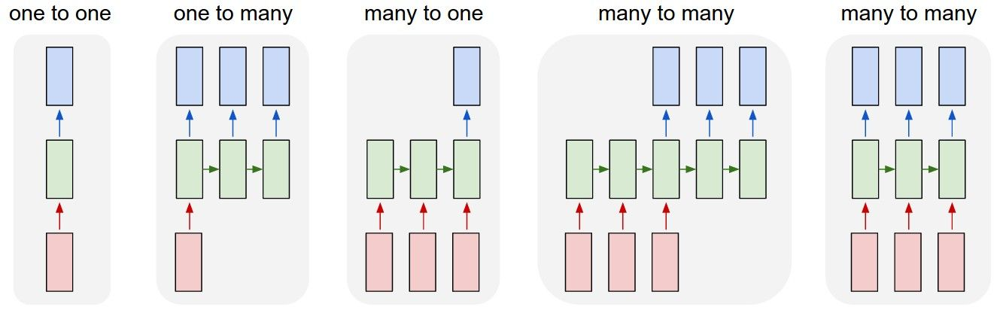
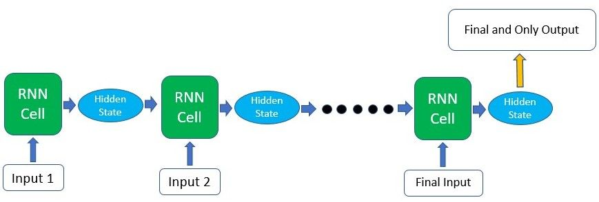
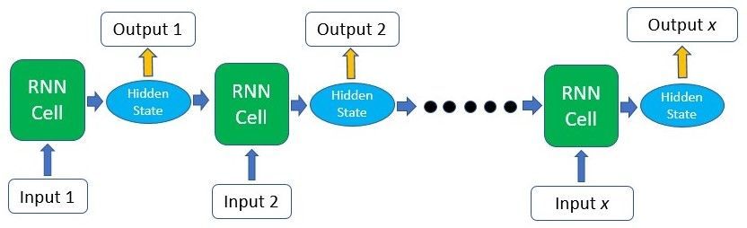

# Recurrent Neural Networks  
https://blog.floydhub.com/a-beginners-guide-on-recurrent-neural-networks-with-pytorch/  

## basic concepts  
RNNs do not consume all the input data at once.  
Instead, they take them in one at a time and in a sequence.  
At each step, the RNN does a series of calculations before producing an output.  
The output, known as the hidden state, is then combined with the next input in the sequence to produce another output.  
This process continues until the model is programmed to finish or the input sequence ends.  

the calculations at each time step consider the context of the previous time steps in the form of the hidden state  

the underlying principle of Recurrent Neural Networks is that the RNN cell is actually the exact same one and reused throughout  

## outputs:  
RNNs are flexible and can adapt to your needs. The input and output size can come in different forms, yet they can still be fed into and extracted from the RNN model.  

- if you’re using the RNN for a classification task, you’ll only need one final output after passing in all the input - a vector representing the class probability scores.  
- if you’re doing text generation based on the previous character/word, you’ll need an output at every single time step.  


  

#### one to one  

#### one to many  

#### many to one  
  
For the case where you’ll only need a single output from the whole process, getting that output can be fairly straightforward as you can easily take the output produced by the last RNN cell in the sequence. As this final output has already undergone calculations through all the previous cells, the context of all the previous inputs has been captured. This means that the final result is indeed dependent on all the previous computations and inputs.  

#### many to many  
  
need output information from the intermediate time steps, this information can be taken from the hidden state produced at each step as shown in the figure above. The output produced can also be fed back into the model at the next time step if necessary.  

## inner computations 

basic computations --> RNN's cells to do to produce the hidden states and outputs  
```
hidden(t) = F(hidden(t-1), input(t))  
```

- first step: a hidden state will usually be seeded as a matrix of 0s (so it can be fed into the RNN cell together with the first input in the sequence)  
- the hidden state and the input data will be multiplied with weight matrices initialized via a scheme such as Xavier or Kaiming  
- The result of these multiplications will then be passed through an activation function(such as a tanh function) to introduce non-linearity.  
```
hidden(t) = tanh(weight(hidden)*hidden(t-1)+weight(input)*input(t))  
```

- if we require an output at the end of each time step we can pass the hidden state that we just produced through a linear layer or just multiply it by another weight matrix to obtain the desired shape of the result.  
```
output(t) = weight(output) * hidden(t)  
```

## training and back-propagation  
How weights are updated through back-propagation.   
   

+ during training:  
    - pass the input data through the model  
    - calculate the loss of that process (how far off the model’s output is from the correct answer)  
    - using this loss, we can calculate the gradient of the loss function for back-propagation  
    - with the gradient --> update the weights  
    - future computations with the input data and new weights will produce more accurate results  
**all of the weights are actually the same as that RNN cell is essentially being re-used throughout the process. Therefore, only the input data and hidden state carried forward are unique at each time step**    


## textual input data  
- text data --> converted to a set of numbers  
    + embeddings  
    + one-hot encodings  
    + ...

[RNN implementation](rnn_textual_example.py) 


